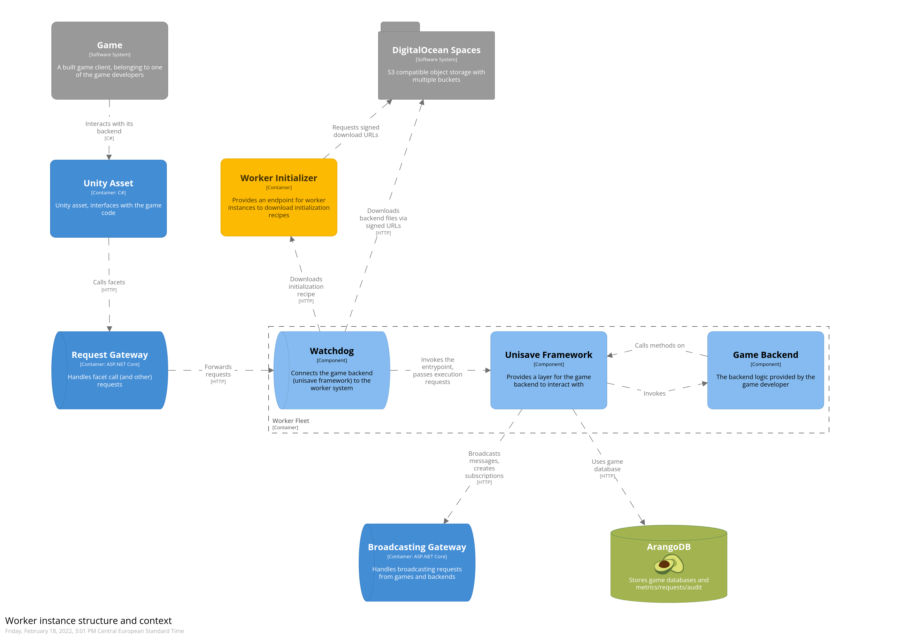

# Unisave Watchdog

Watchdog is a process that runs inside a worker instance container and connects the game backend to the worker system. Its placement in the context of the worker system can be seen in the following diagram:

## Documentation

- [Overview](docs/overview.md)
- Intialization
- Execution
- Metrics
- [HTTP API](docs/api)

## Development

> TODO: describe the development setup.

## Legacy notes that might be useful in the future

- For now, we execute synchronous requests only (up to 30 seconds)
- Most requests are quick (100ms) while some may wait on external
  services and be longer (5s).
- Sandboxes will execute user code in AppDomain and monitor for memory
  leakage and restart the AppDomain when needed. AppDomains will also
  provide a basic security layer.
- Request body (upload) should be below 1MB (Nginx and NATS have the
  same default limit). Larger uploads have to uploaded directly to
  object storage via signed URLs:
  https://aws.amazon.com/blogs/compute/uploading-to-amazon-s3-directly-from-a-web-or-mobile-application/
- Response body size limit... let's make it 10MB! (because then we hit
  serialization problems and JSON problems anyways)